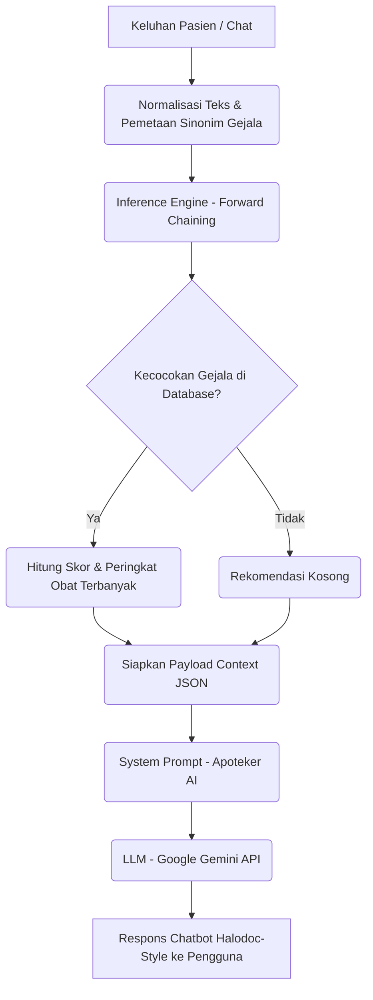

# Apotek AI (Expert System & AI-Powered Pharmacy Consultant)

<p align="center">
  
  <br>
  <strong>Tugas Akhir & Portofolio — Terdaftar HKI (Hak Kekayaan Intelektual)</strong>
</p>

---

## 🔒 Pemberitahuan Hak Kekayaan Intelektual (HKI)
> [!IMPORTANT]
> **PROYEK INI TELAH TERDAFTAR SEBAGAI HAK KEKAYAAN INTELEKTUAL (HKI) REPUBLIK INDONESIA.**
> 
> Seluruh kode sumber, arsitektur sistem, dan modul integrasi dalam repositori ini dilindungi di bawah undang-undang Hak Cipta untuk keperluan Tugas Akhir Akademik. **Dilarang keras menyalin, memodifikasi, mendistribusikan, atau menyalahgunakan aset di dalam repositori ini tanpa izin tertulis dari pemegang hak cipta.**
> 
> *Tujuan Publikasi: Repositori ini dipublikasikan secara terbatas hanya sebagai portofolio kompetensi pengembangan perangkat lunak.*

---

## 📝 Tentang Proyek
**Apotek AI** adalah platform konsultasi farmasi pintar berbasis web yang menggabungkan metode kecerdasan buatan konvensional (**Sistem Pakar Forward Chaining**) dengan teknologi **Generative AI (Google Gemini API)**. 

Aplikasi ini membantu pengguna mengidentifikasi gejala penyakit ringan secara mandiri, memberikan rekomendasi obat yang relevan berdasarkan database klinis apotek, serta menyajikan penjelasan medis yang ramah, ringkas, dan aman (gaya *Halodoc-style*) melalui asisten virtual (Apoteker AI).

### 🚀 Alur Kerja Sistem (Hybrid Architecture)


---

## ✨ Fitur Utama
* **Pencarian & Katalog Obat:** Manajemen dan filter obat berdasarkan gejala penyakit.
* **Sistem Pakar Forward Chaining:** Mesin inferensi lokal untuk mencocokkan gejala masukan pengguna dengan dosis, klasifikasi obat (Bebas/Terbatas/Keras), dan indikasi secara presisi.
* **Integrasi Gemini 2.5/1.5 Flash:** Menerjemahkan data teknis sistem pakar menjadi dialog percakapan apoteker yang mudah dipahami pasien.
* **E-Commerce Minimalis:** Keranjang belanja (`/keranjang`), Checkout, dan Histori Pemesanan Obat.
* **Sistem Autentikasi:** Registrasi, Login, dan manajemen profil pengguna terproteksi.

---

## 🛠️ Stack Teknologi
* **Framework Utama:** [Laravel 11](https://laravel.com) (PHP 8.2+)
* **Frontend Reactive:** [Laravel Livewire](https://laravel-livewire.com)
* **Styling & UI:** [Tailwind CSS](https://tailwindcss.com)
* **Bundler:** [Vite](https://vite.dev)
* **AI Engine:** [Google Gemini API (SDK / HTTP Client)](https://ai.google.dev/)
* **Database:** MySQL / MariaDB

---

## 📁 Struktur Dokumentasi Proyek
Untuk menjaga kebersihan kode utama dan mempermudah pemahaman, dokumentasi proyek diletakkan pada lokasi berikut:

* **README.md (File Ini):** Panduan instalasi cepat, gambaran umum fitur, arsitektur, dan lisensi.
* **Dokumentasi Tambahan (Opsional):** Jika Anda memiliki file diagram ERD, manual book, atau bukti sertifikat HKI, Anda dapat menyimpannya di dalam folder `/docs` di dalam repositori ini:
  * `docs/arsitektur-sistem.md` — Penjelasan detail flowchart & database schema.
  * `docs/panduan-pengguna.md` — Panduan penggunaan aplikasi disertai screenshot UI.

---

## ⚙️ Panduan Instalasi Lokal (Development)

Jika Anda ingin menjalankan proyek ini secara lokal untuk kebutuhan pengujian:

### 1. Klon Repositori
```bash
git clone https://github.com/username/apotek-ai.git
cd apotek-ai
```

### 2. Instalasi Dependensi
```bash
# Composer (Backend PHP)
composer install

# NPM (Frontend Assets)
npm install
```

### 3. Konfigurasi Environment File
Salin file `.env.example` menjadi `.env` kemudian lakukan konfigurasi database dan API key Anda.
```bash
cp .env.example .env
```
Buka `.env` dan tambahkan API Key Gemini Anda:
```env
GEMINI_API_KEY=your_gemini_api_key_here
```

### 4. Generate Key & Migrasi Database
```bash
php artisan key:generate
php artisan migrate --seed
```
*(Catatan: Pastikan database MySQL Anda sudah aktif sebelum menjalankan migrasi).*

### 5. Jalankan Server Lokal
Jalankan server Laravel dan compiler aset frontend secara bersamaan di terminal terpisah:
```bash
# Terminal 1: Menjalankan Laravel
php artisan serve

# Terminal 2: Menjalankan Vite Asset Bundler
npm run dev
```

Aplikasi dapat diakses melalui browser di `http://127.0.0.1:8000`.

---

## 📄 Lisensi & Hak Cipta
Hak Cipta dilindungi Undang-Undang. Seluruh kekayaan intelektual atas aplikasi **Apotek AI** ini terdaftar pada sistem Direktorat Jenderal Kekayaan Intelektual (DJKI) Kementerian Hukum dan HAM RI. Penggunaan kode ini hanya ditujukan untuk bahan evaluasi portofolio.
